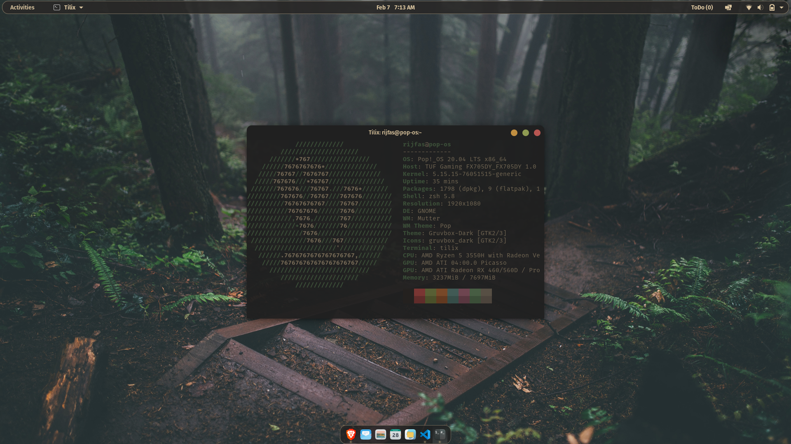

# Rijfas's ~~dotfiles~~ *theme files*🙄

Your dotfiles are how you personalize your system. These are mine 😌.

# Screenshots

---

## Fonts

- Cascadia Code [(repo)](https://github.com/microsoft/cascadia-code)
- MesloLGS NF [(repo)](https://github.com/romkatv/powerlevel10k/blob/master/font.md)

---

## Gnome theme

- Gruvbox GTK Theme [(gnome-look)](https://www.gnome-look.org/p/1681313)

---

## Icon theme

- Gruvbox Icons Theme [(gnome-look)](https://www.gnome-look.org/p/1681460)

---

## Plank theme

- Gruvbox for Plank Dock Themes [(gnome-look)](https://www.gnome-look.org/p/1681813)

---

## Tilix theme

- Gruvbox Tilix Theme [(repo)](https://github.com/Fausto-Korpsvart/Gruvbox-GTK-Theme/tree/master/tilix)

---

## Rofi theme

- Gruvbox rofi [(repo)](https://github.com/bardisty/gruvbox-rofi)

---

## VS Code theme

- Gruvbox Material [(repo)](https://github.com/sainnhe/gruvbox-material-vscode)

---

## Chrome theme

- Gruvbox theme [(webstore)](https://chrome.google.com/webstore/detail/gruvbox-theme/ihennfdbghdiflogeancnalflhgmanop?hl=en-GB)

---

## Shell

- oh-my-zsh [(website)](https://ohmyz.sh/)
- powerlevel10k [(repo)](https://github.com/romkatv/powerlevel10k)

---

## Wallpaper

---

## Thanks

- [Fausto-Korpsvart](https://github.com/Fausto-Korpsvart) and his [Gruvbox-GTK-Theme](https://github.com/Fausto-Korpsvart/Gruvbox-GTK-Theme)
- All other contributers and nice hearts ❤️
